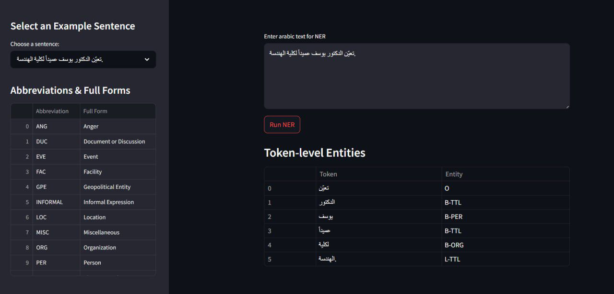

# Arabic-NER

A lightweight Named Entity Recognition (NER) tool designed for Arabic text.  
It detects **names**, **locations**, **organizations** and so on, using a fine-tuned BERT-based model.

---

## 📊 Dataset

We used the [Arabic NER MAFAT dataset](https://huggingface.co/datasets/iahlt/arabic_ner_mafat), containing **40,000** annotated samples.

| Split        | Count   | Percentage |
|--------------|---------|------------|
| Training     | 32,000  | 80%        |
| Validation   | 4,000   | 10%        |
| Test         | 4,000   | 10%        |

The dataset includes token-level annotations for various named entity categories.

---

## Model Overview

This project fine-tunes the pre-trained `asafaya/bert-base-arabic` model to perform token-level classification for the NER task.  
We added a classification head on top and trained it to recognize common entity types in Modern Standard Arabic.

- Model Type: `BERT` (AutoModelForTokenClassification)
- Task: Named Entity Recognition (NER)
- Entities: `PER` (Person), `LOC` (Location), `ORG` (Organization), etc.

---

## 🖥️ GUI Preview

The tool includes a simple and interactive graphical user interface (GUI) to test Arabic text inputs and highlight detected entities.

